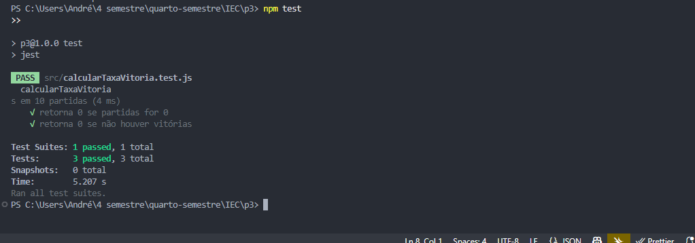

````markdown
# Prova III - Integração e Entrega Contínua (Fatec Jacareí)

## 1. Controle de Versão

- Branches: main, develop, feature/\*
- Commits atômicos
- Merge com `--no-ff`
- Exemplo de comandos:

```bash
git checkout main
git checkout -b develop
git checkout -b feature/teste
git add . && git commit -m "feat: add nova feature"
git push origin feature/teste
```
````

## 2. GitHub Actions

Arquivo `.github/workflows/ci.yml` realiza testes automáticos com Node.js usando Jest.

## 3. Testes Automatizados

Usamos Jest para validar a função `calcularTaxaVitoria` com cobertura de casos extremos.

### Resultado dos testes



## 4. Logging com Firebase

Logs com `console.log`, `console.error` são exibidos em tempo real no Firebase Console > Logs.

## 5. Deploy Firebase Hosting

Comandos:

```bash
firebase login
firebase init hosting
npm run build
firebase deploy
```

GitHub Actions pode usar `firebase-action` com token salvo nos Secrets.

---

Arquivo pronto para entrega: **Prova03_SeuNome.pdf**

```

```
